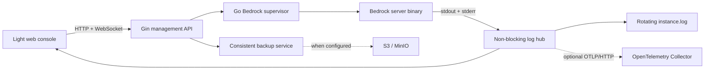
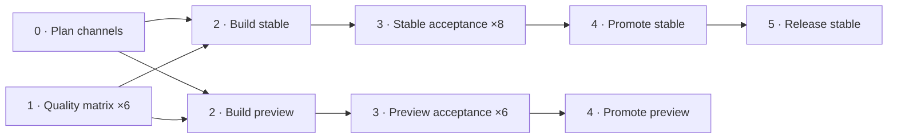

<h1 align="center">Montainer</h1>
<h3 align="center">A container-first Minecraft Bedrock server manager with a Go backend, web console, backups, and optional OpenTelemetry logs</h3>

<p align="center">
  
  
  
</p>

Montainer combines the Minecraft Bedrock Dedicated Server with a small management service and a browser-based console. It owns the Bedrock process lifecycle, persists server data through Docker volumes, and keeps the normal standalone experience working even when S3 or observability services are not configured.

The project was inspired by the problem described in [How web automation saved my friendship](https://youtu.be/fQo9j648l5s?si=9dq58Pp1uaxU-fKY).

## What v3 provides

- **Go and Gin backend** — the Python backend has been replaced by a compiled Go process supervisor, with Gin limited to the HTTP transport.
- **Safe Bedrock lifecycle** — start, stop, toggle, restart, command dispatch, unexpected-exit tracking, and graceful application shutdown are serialized so two Bedrock processes cannot overlap.
- **Modern light web console** — a responsive console-first UI shows the real server state, live logs, uptime, PID, generation, lifecycle actions, and backup results.
- **Minecraft command assistance** — an offline Bedrock command catalog provides autocomplete without querying the running server. Common commands include contextual values, and `tp`/`teleport` shows server-oriented syntax, selectors, coordinates, `facing`, and boolean hints.
- **Independent local logging** — stdout and stderr remain available through the web UI, HTTP API, WebSocket stream, and a rotating `instance.log` file.
- **Optional OpenTelemetry export** — logs can additionally be exported over OTLP/HTTP protobuf. Collector failures are isolated from local logging and server management.
- **S3-compatible backups** — Montainer can briefly stop a running server, create a consistent ZIP snapshot, restore the previous running state, and upload the archive to S3 or MinIO.
- **Persistent configuration and worlds** — worlds, configuration files, resource packs, and logs use separate volume paths that retain the existing deployment contract.
- **Subpath hosting** — all management and streaming routes can be served below a prefix for reverse-proxy and multi-instance deployments.
- **Acceptance-tested business behavior** — Cucumber/Godog scenarios run the real Montainer binary against a controllable fake Bedrock process and an in-process OTLP receiver.

## Architecture



The management API, local file sink, browser stream, and OTLP exporter consume the same normalized Bedrock records. Each log sink has its own bounded queue, so a slow or unavailable external destination cannot block the server process or web console.

## Quick start

The official Bedrock server is an AMD64 Linux binary. The image therefore targets `linux/amd64`, including when it is run through Docker Desktop or Linux `binfmt` emulation on ARM64.

```bash
docker run -d \
  --name montainer \
  --platform linux/amd64 \
  --restart unless-stopped \
  --stop-timeout 90 \
  -p 127.0.0.1:8000:8000 \
  -p 19132:19132/udp \
  -p 19133:19133/udp \
  -v montainer_worlds:/app/instance/worlds \
  -v montainer_configs:/app/configs \
  -v montainer_resource_packs:/app/resource_packs \
  -v montainer_logs:/app/logs \
  ghcr.io/wasinuddy/montainer-stable:latest
```

Use `ghcr.io/wasinuddy/montainer-preview:latest` for the Bedrock Preview channel.

Use `ghcr.io/wasinuddy/montainer-stable:<minecraft-version>` or `ghcr.io/wasinuddy/montainer-preview:<minecraft-version>` to stay on a specific Bedrock binary while receiving newly accepted Montainer rebuilds. These Minecraft-version tags are intentionally overwritten after the full acceptance matrix passes. For a completely immutable deployment, use the `:<minecraft-version>@sha256:<digest>` reference published in the matching GitHub release.

Open [http://localhost:8000](http://localhost:8000) after the container becomes healthy. Bedrock starts automatically by default.

> [!WARNING]
> Montainer does not currently provide authentication or authorization. Keep port `8000` on a trusted network or put it behind an authenticated reverse proxy. Do not expose the management API directly to the public internet.

## Using the web console

The top server bar exposes the current lifecycle state and Start/Stop, Restart, and Backup controls. The console supports:

- live WebSocket updates with HTTP log refresh as the source of complete history;
- search and Info, Warning, or Error filtering;
- pause, resume, copy, follow, and jump-to-latest behavior;
- command history with the up/down arrow keys; and
- keyboard command completion with `Tab`, arrow-key selection, and `Enter`.

Typing `tp ` shows common dedicated-server teleport signatures and target/coordinate suggestions. For example, `tp @p ~` followed by `Tab` completes the relative coordinate triplet. A leading `/` is accepted by the UI and removed before the command is sent to the dedicated-server console.

Autocomplete is intentionally offline and deterministic. It does not send hidden `help` commands, scrape shared logs for a response, or require a particular server language.

## Docker Compose, backup, and MinIO

The supplied Compose stack includes Montainer, MinIO, and a one-shot bucket initializer:

```bash
cp examples/docker/.env.example examples/docker/.env
# Set unique MINIO_ROOT_USER and MINIO_ROOT_PASSWORD values in the new file.

docker compose \
  --env-file examples/docker/.env \
  -f examples/docker/docker-compose.yaml \
  up -d
```

The Compose example binds the unauthenticated Montainer API and both MinIO administration ports to `127.0.0.1`; only the Minecraft UDP ports listen on all host interfaces. It uses Docker-managed named volumes and creates the backup bucket before Montainer starts.

When S3 settings are present, the Backup action:

1. acquires the exclusive lifecycle lease;
2. gracefully stops Bedrock if it was running;
3. snapshots the instance and persistent configuration directories;
4. restores the previous running state;
5. builds the ZIP archive; and
6. uploads it without holding the lifecycle lease.

Only one backup runs at a time. A browser disconnect does not cancel an accepted backup, while application shutdown still provides a bounded cancellation and recovery path.

## Optional OpenTelemetry Collector

OpenTelemetry is additive. With no OTLP endpoint, Montainer runs normally with its web console and rotating local log file. When an endpoint is configured, the same Bedrock records are also exported without making the Collector part of server health or lifecycle behavior.

Start the example Collector overlay:

```bash
docker compose \
  --env-file examples/docker/.env \
  -f examples/docker/docker-compose.yaml \
  -f examples/docker/docker-compose.otel.yaml \
  up -d

docker compose \
  --env-file examples/docker/.env \
  -f examples/docker/docker-compose.yaml \
  -f examples/docker/docker-compose.otel.yaml \
  logs -f otel-collector
```

The example Collector uses its debug exporter. Replace that exporter with OTLP, Loki, or a vendor exporter for production. Minecraft logs can contain player names, IP addresses, chat, and commands, so protect the telemetry destination accordingly.

Only `http/protobuf` log export is currently supported. `OTEL_EXPORTER_OTLP_LOGS_ENDPOINT` is used exactly as supplied; the generic `OTEL_EXPORTER_OTLP_ENDPOINT` receives `/v1/logs` automatically.

## Persistent data and container permissions

| Container path | Purpose |
|---|---|
| `/app/instance/worlds` | Bedrock world databases |
| `/app/configs` | `server.properties`, `allowlist.json`, and `permissions.json` |
| `/app/resource_packs` | Persistent resource packs copied into the Bedrock instance before start without replacing packaged files |
| `/app/logs` | `instance.log` and its rotated backups |

Before each start, persistent configuration is copied into the Bedrock instance. On first run, packaged defaults are copied out to the configuration volume. Configuration is persisted again only after the child process has been reaped.

Montainer and Bedrock run as UID/GID `10001`. The default Docker entrypoint starts as root, makes the configured Bedrock instance and persistence roots belong to that identity, migrates legacy root-owned entries below them, validates every required directory and file, then irrevocably drops its groups and capabilities before it starts Montainer. Mutating scans prune kernel-reported nested mounts, and the validation repeats on every start so a rollback or sidecar cannot leave newly inaccessible LevelDB files hidden behind stale migration state.

Set `MONTAINER_AUTO_CHOWN=false` only when UID/GID `10001` already has the required access: read/write for the instance, worlds, configuration, and logs, and read access for resource packs. The migration rejects symbolic links in configured path components, internal symbolic links outside resource-pack trees, special files, protected system roots, and overlaps between configured roots (apart from the required `INSTANCE_DIR/worlds` nesting). Resource-pack symlinks remain supported and are handled without root dereferencing. The scan never changes entries below a nested mount and fails before Bedrock starts if ownership, modes, ACLs, or storage behavior still deny access. Custom `INSTANCE_DIR`, `CONFIG_DIR`, `RESOURCE_PACKS_DIR`, and `LOG_DIR` values are honored; point each at a distinct, dedicated data directory.

The bootstrap requires exclusive access to those mounts. Do not let a sidecar or host process add mounts, replace path components, or rewrite the data tree while the ownership scan is running. For shared-writer storage, stop every writer and perform a one-time storage-side migration, then run with `MONTAINER_AUTO_CHOWN=false`.

The image is configured as root so the entrypoint can repair existing Docker volumes. In the default bootstrap profile, the application, Bedrock child, and health probe all run as UID/GID `10001` with no capabilities and `no_new_privs`. Docker starts ad-hoc `exec` commands from the configured image identity, so use `docker compose exec --user 10001:10001 montainer ...` unless a deliberate recovery operation requires root.

Preserve the image entrypoint. Overriding it with Kubernetes `command`, Compose `entrypoint`, or `docker run --entrypoint /app/montainer` bypasses migration and the root-to-`10001` security boundary. If an override is unavoidable, configure UID/GID `10001`, drop all capabilities, and enable `no-new-privileges` at the container runtime.

An explicitly non-root container skips ownership migration and therefore requires already-accessible storage. Because a non-root process cannot clear its own kernel capability bounding set, also ask the container runtime to drop it; the entrypoint refuses a weaker configuration:

```yaml
services:
  montainer:
    user: "10001:10001"
    cap_drop:
      - ALL
    security_opt:
      - no-new-privileges:true
```

Kubernetes deployments can keep the container non-root with this security context:

```yaml
spec:
  securityContext:
    runAsNonRoot: true
    runAsUser: 10001
    runAsGroup: 10001
    fsGroup: 10001
    fsGroupChangePolicy: Always
    seccompProfile:
      type: RuntimeDefault
  containers:
    - name: montainer
      securityContext:
        allowPrivilegeEscalation: false
        capabilities:
          drop: ["ALL"]
```

This skips the root bootstrap. A CSI driver with volume-group support can make a pre-v3 PVC accessible through `fsGroup`; otherwise use a stopped one-time Job, init container, or storage-layer ACL/ownership change. Some CSI drivers perform the group change themselves and ignore `fsGroupChangePolicy`, so verify the resulting recursive access before starting Bedrock.

To recover a volume before the fixed image is available, first stop Bedrock cleanly and take a raw volume snapshot. The following command targets the supplied Compose stack; for another deployment, run the equivalent command with its normal Compose file and environment options while the Montainer service remains stopped. Run it with the exact original Compose project identity—same directory and any `--project-name`/`COMPOSE_PROJECT_NAME` value—and inspect the resolved mounts first, otherwise Compose can create fresh volumes instead of repairing the server's real data.

```bash
docker compose \
  --env-file examples/docker/.env \
  -f examples/docker/docker-compose.yaml \
  run --rm --no-deps --user 0:0 --entrypoint sh montainer -ceu '
  for path in /app/instance /app/instance/worlds /app/configs /app/resource_packs /app/logs; do
    [ -e "$path" ] || continue
    mounts=$(findmnt -R -l -n -o TARGET --target "$path")
    set -- "$path" -xdev
    while IFS= read -r nested; do
      case "$nested" in
        *\\x[0-9A-Fa-f][0-9A-Fa-f]*)
          printf "refusing escaped or control-character mount target below %s\n" "$path" >&2
          exit 1
          ;;
      esac
      case "$nested" in
        "$path") ;;
        "$path"/*)
          pattern=$(printf "%s\n" "$nested" | sed "s/[][\\\\*?]/\\\\&/g")
          set -- "$@" -path "$pattern" -prune -o
          ;;
      esac
    done <<EOF
$mounts
EOF
    set -- "$@" \
      \( -type d -o \( \( -type f -o -type l \) -links 1 \) \) \
      \( -uid 0 -o -gid 0 \) \
      -exec chown --no-dereference 10001:10001 {} +
    find "$@"
  done
'
```

This repair preserves non-root custom ownership, avoids multiply linked files, and prunes nested mounts. An inaccessible hardlink, a bind-mount root owned by another host UID, or storage that rejects ownership changes needs a deliberate host-side ownership or ACL decision. Do not add `--volumes` to a Compose shutdown command and do not run this while either the old or new Bedrock process is using LevelDB.

Use a container or Kubernetes termination grace period of at least `90s` with the default lifecycle timeouts. If the timeouts are increased, allow at least:

```text
2 × BEDROCK_SHUTDOWN_TIMEOUT + 3 × BEDROCK_LIFECYCLE_TIMEOUT + 15s
```

## Configuration

### Core runtime

| Variable | Description | Default |
|---|---|---|
| `LISTEN_ADDR` | HTTP listen address. | `:8000` |
| `SUBPATH_URL` | Optional URL prefix, normalized with leading and trailing `/`. | `/` |
| `INSTANCE_NAME` | Instance label and OTEL `service.instance.id`. | `Montainer` |
| `BEDROCK_SERVER_PATH` | Bedrock executable path. | `./bedrock_server` |
| `INSTANCE_DIR` | Bedrock working directory. | `./instance` (`/app/instance` in Docker) |
| `CONFIG_DIR` | Persistent configuration directory. | `./configs` (`/app/configs` in Docker) |
| `RESOURCE_PACKS_DIR` | Persistent resource-pack source. | `./resource_packs` (`/app/resource_packs` in Docker) |
| `STATIC_DIR` | Built frontend directory. | `./web/dist` (`/app/dist` in Docker) |
| `MONTAINER_AUTO_CHOWN` | Docker entrypoint migrates legacy root-owned data before dropping privileges. | `true` |
| `BEDROCK_AUTO_START` | Start Bedrock with Montainer. | `true` |
| `BEDROCK_SHUTDOWN_TIMEOUT` | Graceful child-process stop timeout. | `15s` |
| `BEDROCK_LIFECYCLE_TIMEOUT` | Timeout for each pre-start or post-stop filesystem phase. | `15s` |
| `BACKUP_TIMEOUT` | Maximum accepted backup duration. | `30m` |

### Local logs

| Variable | Description | Default |
|---|---|---|
| `LOG_DIR` | Directory containing `instance.log`. | `.` (`/app/logs` in Docker) |
| `LOG_HISTORY_SIZE` | Maximum recent records retained for HTTP and the web console. | `1000` |
| `LOG_SINK_QUEUE_SIZE` | Independent queue capacity for each file or OTLP sink. | `2048` |
| `LOG_FILE_MAX_SIZE_MB` | Rotate `instance.log` after this size in MiB. | `100` |
| `LOG_FILE_MAX_BACKUPS` | Rotated `instance.log.N` files to retain. | `5` |

The `/status` response reports file and OTLP drop counters. A full or failing sink can drop its own copy without preventing delivery to other sinks.

### S3-compatible backup

| Variable | Description | Default |
|---|---|---|
| `AWS_S3_ENDPOINT` | S3-compatible endpoint. A blank value disables backup storage. | disabled |
| `AWS_S3_KEY_ID` | Access key ID. | empty |
| `AWS_S3_SECRET_KEY` | Secret access key. | empty |
| `AWS_S3_BUCKET_NAME` | Destination bucket. | empty |
| `AWS_S3_REGION` | S3 region. | empty |

### OpenTelemetry logs

| Variable | Description | Default |
|---|---|---|
| `OTEL_EXPORTER_OTLP_ENDPOINT` | Generic OTLP/HTTP endpoint; `/v1/logs` is appended. | disabled |
| `OTEL_EXPORTER_OTLP_LOGS_ENDPOINT` | Signal-specific logs endpoint used exactly as supplied; include `/v1/logs`. Takes precedence. | disabled |
| `OTEL_EXPORTER_OTLP_PROTOCOL` | Generic OTLP protocol fallback. | `http/protobuf` |
| `OTEL_EXPORTER_OTLP_LOGS_PROTOCOL` | Signal-specific protocol; takes precedence. | unset |
| `OTEL_EXPORTER_OTLP_INSECURE` | Generic insecure transport setting. | `false` |
| `OTEL_EXPORTER_OTLP_LOGS_INSECURE` | Signal-specific insecure setting; takes precedence. | unset |
| `OTEL_EXPORTER_OTLP_TIMEOUT` | Generic per-request timeout, as milliseconds or a Go duration. | `10000` |
| `OTEL_EXPORTER_OTLP_LOGS_TIMEOUT` | Signal-specific request timeout; takes precedence. | unset |
| `OTEL_SERVICE_NAME` | OTEL `service.name`. | `montainer` |
| `OTEL_RESOURCE_ATTRIBUTES` | Comma-separated resource attributes; percent-encoded values are supported. | empty |
| `MONTAINER_VERSION` | Optional OTEL `service.version`. | empty |
| `OTEL_SDK_DISABLED` | Disable telemetry even when an endpoint is present. | `false` |
| `OTEL_BLRP_MAX_QUEUE_SIZE` | OTEL batch processor queue capacity. | `2048` |
| `OTEL_BLRP_MAX_EXPORT_BATCH_SIZE` | Maximum records in one export batch. | `512` |
| `OTEL_BLRP_SCHEDULE_DELAY` | Batch interval, as milliseconds or a Go duration. | `5000` |
| `OTEL_BLRP_EXPORT_TIMEOUT` | Batch export timeout, as milliseconds or a Go duration. | `30000` |

## Management API

All routes except the root health checks are scoped below `SUBPATH_URL` when configured.

| Method | Route | Purpose |
|---|---|---|
| `GET` | `/` | Serve the web UI |
| `GET` | `/healthz` | Process liveness |
| `GET` | `/readyz` | Readiness and current Bedrock state |
| `GET` | `/status` | Lifecycle snapshot, PID, generation, errors, and dropped-log counters |
| `POST` | `/start` | Start Bedrock |
| `POST` | `/stop` | Gracefully stop Bedrock |
| `POST` | `/toggle` | Atomically start or stop based on current state |
| `POST` | `/restart` | Gracefully replace the running child process |
| `POST` | `/command` | Send a JSON `{ "command": "..." }` request to Bedrock stdin |
| `GET` | `/logs?max_lines=N` | Return recent local log lines |
| `GET` | `/instance_name` | Return the configured display name |
| `POST` | `/save` | Create and upload a consistent backup |
| `WS` | `/ws/stream` | WebSocket lifecycle and recent-log stream |

The route names and compatibility JSON envelopes remain aligned with the v1 frontend contract. Lifecycle work has a server-owned context, so disconnecting an HTTP client after a stop, restart, or backup has been accepted cannot strand the child process halfway through the operation.

## Reverse proxies and Kubernetes

Set `SUBPATH_URL=/servers/friends` to serve the UI, API, assets, and WebSocket stream below `/servers/friends/`. The reverse proxy must forward WebSocket upgrades for `ws/stream`.

For Kubernetes:

- expose the HTTP/WebSocket port through an authenticated Ingress;
- expose Bedrock UDP ports through a suitable `LoadBalancer` or UDP-aware service; and
- set `spec.terminationGracePeriodSeconds` to at least `90` with default timeouts.

## Developing v2

Prerequisites are Go 1.26, Node.js 22, and Docker for complete image testing.

```bash
go test -count=1 ./...
go test -race -count=1 ./...
go vet ./...

cd frontend
npm ci
npm run lint
npm test
npm run build
```

The frontend test suite covers backend URL/error compatibility, UI formatting and log filtering, the offline command catalog, alias preservation, contextual values, teleport syntax guidance, and caret-safe completion.

### Acceptance tests

The fast Godog suite builds and launches the real `cmd/montainer` process while replacing only the Mojang binary with `test/fixtures/fakebedrock`:

```bash
go test -v -count=1 ./acceptance

GODOG_TAGS='@lifecycle' go test -v -count=1 ./acceptance
GODOG_TAGS='@logging' go test -v -count=1 ./acceptance
GODOG_TAGS='@otel' go test -v -count=1 ./acceptance
```

See [acceptance/README.md](acceptance/README.md) for binary overrides, temporary-workspace diagnostics, and the covered business behavior.

A separate Docker acceptance suite exercises an already-built image with its packaged Mojang binary. It creates an isolated network and container stack per scenario and covers exact-version startup, RakNet discovery, concurrent lifecycle requests, OTLP export (`@otel-export`), Collector outage isolation (`@otel-outage`), shutdown flushing (`@otel-flush`), concurrent MinIO backups, ZIP integrity, and post-backup gameplay readiness. Its stable-only upgrade shard creates logical scoreboard state with the digest-pinned pre-v3 image, reuses that image's root-owned volumes under the candidate, joins that upgraded world with a virtual player, downloads the S3 backup, restores it externally into fresh named volumes, and queries the same scoreboard state from that restored world. Separate scenarios cover a root-owned custom `INSTANCE_DIR`, literal same-device nested-mount pruning, and the runtime-hardened explicit non-root profile including its Docker health probe. Stable releases also launch an offline virtual Bedrock player that must spawn, appear in the server player list, and receive a teleport movement packet.

```bash
GODOG_TAGS='@smoke' \
MONTAINER_ACCEPTANCE_IMAGE='montainer:local' \
MONTAINER_EXPECTED_BEDROCK_VERSION="$(cat versions/stable.txt)" \
  go test -v -count=1 ./acceptance/realimage
```

### Build an image

```bash
docker build \
  --build-arg SERVER_TYPE=stable \
  --build-arg BEDROCK_VERSION="$(cat versions/stable.txt)" \
  -t montainer:local .

docker build \
  --build-arg SERVER_TYPE=preview \
  --build-arg BEDROCK_VERSION="$(cat versions/preview.txt)" \
  -t montainer:local-preview .
```

The scraper records each channel's version, exact Mojang URL, and archive SHA-256 under `versions/`. The multi-stage build verifies that the URL matches the channel/version and that the downloaded bytes match the pinned checksum before producing the AMD64 Debian image. Its short root bootstrap handles legacy volume ownership; Montainer, Bedrock, and the health probe then run unprivileged.

CI is one connected, numbered DAG. Stage 0 plans the affected release channels while Stage 1 runs a six-row quality matrix: frontend, Go/race/vet/actionlint, and four fake-Bedrock business groups. A main push reuses that matrix once rather than repeating it inside separate stable and preview workflows. Stable-only metadata changes select stable, preview-only metadata changes select preview, and common runtime changes select both. Selective routing is trusted only when the previous commit completed this delivery pipeline successfully; otherwise both channels run.

Stages 2 and 3 build each selected Mojang-backed image once, record a channel-specific archive SHA-256 and image ID, and fan that exact artifact out to eight stable or six preview real-image runners. Every runner verifies both identities before loading the image. Stable additionally upgrades a real root-owned legacy world and backs it up before promotion. Stage 4 gives package-write permission only to the selected channel's promotion job after its matrix succeeds. Stable promotion connects directly to Stage 5, which validates the same-run identity artifact, current Minecraft-version manifest, and recorded digest before considering the latest changelog version for an idempotent GitHub release. All planning, quality, build, and acceptance jobs remain read-only. A common main-branch change now schedules 26 runner jobs including release instead of 36, while PR validation remains six concurrent quality jobs. Manual dispatch can select `stable`, `preview`, or `both`, defaults to validation-only, and may publish only with an explicit opt-in on `main`. Preview keeps the protocol-independent RakNet gate because third-party full-client libraries may temporarily lag Mojang preview protocols.



## Migrating from v1

The container image remains the deployment boundary, and the established management routes, subpath behavior, S3 environment names, and persistent volume paths are retained. Important operational differences are:

- the backend is now a single Go binary rather than Python and Uvicorn;
- Python runtime dependencies are no longer installed in the image;
- direct binary runs read process environment variables only; use an explicit launcher or `--env-file` instead of relying on Pydantic `.env` loading;
- Montainer and Bedrock run as UID/GID `10001`; the Docker entrypoint automatically migrates root-owned files in the Bedrock instance and four documented persistence roots, while explicitly non-root Kubernetes deployments require effective `fsGroup` handling or a one-time volume migration;
- lifecycle operations are serialized and report explicit states instead of relying only on a boolean;
- conflicting lifecycle requests now return `409`, an unconfigured backup returns `503`, and timeout/cancellation status mapping is more explicit;
- HTTP and WebSocket clients are expected to be same-origin; cross-origin consumers should use a correctly configured reverse proxy;
- logs are rotated and can fan out to OTLP without disabling local access; and
- the image is explicitly built for `linux/amd64` because the Bedrock binary has no native ARM64 release; each channel publishes the exact Minecraft Bedrock version as its tag (for example, `1.26.33.2`) and overwrites that tag after a newly accepted Montainer rebuild, while release notes provide a digest-pinned reference for immutable deployments.

Stop Bedrock cleanly and take a raw snapshot of existing volumes before upgrading. Reuse the same worlds, configs, resource-pack, and log mounts; the default Docker startup performs the bounded ownership migration automatically. Do not delete, upload, or ask LevelDB to repair a world that still works on a pre-v3 image—the v3.0.1 `Permission denied (13)` failure was an ownership regression, not a world-format migration. Allow a `90s` termination grace period for the first v3 deployment.

## Contributing

Contributions are welcome. Please include tests at the lowest useful layer and add or update an acceptance feature when behavior at the process, HTTP, WebSocket, storage, or telemetry boundary changes.

---

<p align="center">
Montainer is dedicated to the memories shared with friends while playing Minecraft and to making server management less distracting than the adventures themselves.
</p>
